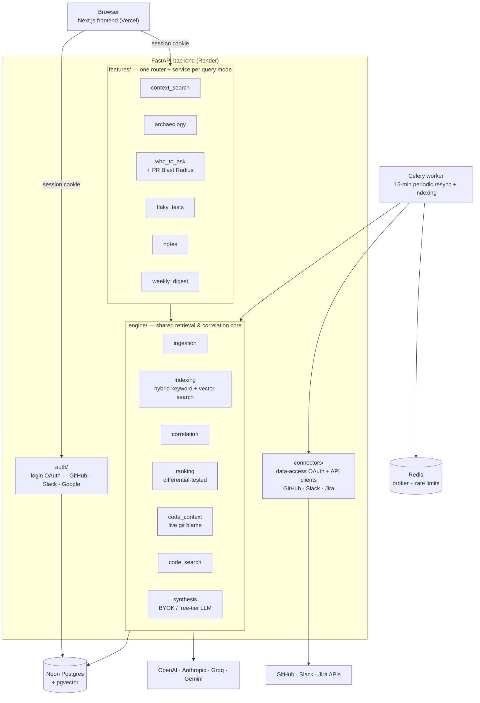

# Relay

A shared context engine that correlates data across GitHub, Slack, and
Jira — exposed through six purpose-built query interfaces built on **one**
retrieval/correlation engine, not six disconnected integrations. Pick a
question, a file, a pull request, or a time window; Relay traces the
connections across every source you've connected and answers from there.

**Live demo:** `https://therelay.vercel.app` — sign in
with GitHub/Slack/Google to try it.

See [`plan.md`](plan.md) for the full original architecture/phase plan,
and [`docs/adr/`](docs/adr/) / [`docs/decisions/`](docs/decisions/) /
[`docs/phases/`](docs/phases/) for the real, ongoing record of what was
built, why, and what was deliberately cut.

## Features

Six query modes, one engine underneath every one of them:

- **Context Search** — ask a question in plain English, get an answer
  synthesized from your connected GitHub/Slack/Jira activity, with real
  source citations (not the model's own guess at what's relevant). Raw
  retrieval mode is always free and on by default; AI-summary mode
  supports OpenAI, Anthropic, Groq, or Gemini — bring your own API key,
  or use Relay's rate-limited free tier (OpenAI only).
- **Codebase Archaeology** — pick a file, and Relay traces its git blame
  (live, via GitHub's GraphQL API) back through each commit to the pull
  request that introduced it, the Jira ticket it closed, and the Slack
  discussion happening at the time.
- **Who Should I Ask** — ranks everyone who's touched a file, a whole
  directory, or a specific pull request ("PR Blast Radius") by recency
  or frequency of contribution — including reviewers who commented
  without ever committing a line, not just authors.
- **Flaky Test Investigator** — tracks each GitHub Actions workflow's
  pass/fail history and flags what looks flaky rather than genuinely
  broken, combining real per-attempt outcome data with a documented
  heuristic fallback where ground truth isn't available.
- **Notes** — freeform notes, or ones annotated directly onto a specific
  commit, PR, ticket, or Slack message. Indexed the same way every
  connector's data is, so notes surface in Context Search too — a note
  is Relay's fourth searchable source, not a separate bolt-on app.
- **Weekly Digest** — a time window instead of a keyword or a file:
  everything across GitHub, Slack, Jira, and Notes in the last N days,
  optionally synthesized into what shipped, what's still being
  discussed, and what looks unresolved.

## Architecture

The core bet: every feature above is a thin router + service that calls
into a **shared engine** — retrieval, indexing, correlation, ranking, and
LLM synthesis all live in one place, used by whichever feature needs
them, never duplicated per-feature. Two engine extractions happened
mid-project specifically because a second feature needed logic a feature
already had (`engine/correlation`, `engine/synthesis`) — the module
boundary isn't just aspirational, it's been enforced in practice.



**Why it's shaped this way:**
- `features/*` may only import from `engine/`, never from another
  `features/*` module — if two features need the same logic, that's the
  signal it belongs in `engine/`, not a reason to cross-import (this
  rule has fired for real twice: `engine/correlation` when Who Should I
  Ask needed Archaeology's ticket-correlation logic, `engine/synthesis`
  when Weekly Digest needed Context Search's LLM-synthesis logic).
- `connectors/*` is the *only* place that talks to GitHub/Slack/Jira's
  real APIs — everything else works against `ingested_items`, a single
  normalized table every connector writes into the same shape.
- Retrieval is genuinely polymorphic, not just "search with different
  filters": keyword query (Context Search), a file/directory/PR (Who
  Should I Ask), git history (Archaeology), and a time window (Weekly
  Digest) are four structurally different ways of asking the same
  underlying engine for relevant items.

## Tech stack

| Layer | Choice |
|---|---|
| Backend | Python, FastAPI, SQLAlchemy 2.0 (async), Alembic |
| Database | PostgreSQL + pgvector (hybrid keyword/vector search), hosted on Neon |
| Background jobs | Celery + Redis |
| LLM synthesis | OpenAI, Anthropic, Groq, Gemini — BYOK or rate-limited free tier |
| Auth | OAuth 2.0 (GitHub, Slack, Google for login; GitHub, Slack, Jira for data access — deliberately separate apps, ADR 0003) |
| Frontend | Next.js (App Router), React, TypeScript, Tailwind CSS |
| Observability | Sentry, structured JSON logging |
| CI | GitHub Actions — ruff, mypy (strict), pytest with a coverage gate |
| Hosting | Render (backend + Celery worker), Vercel (frontend), Neon (Postgres) |

## Testing

```
307 tests passing · 94.7% coverage on engine/ + features/ · CI gate at 85%
```

Split across three kinds, each testing a different thing:
- **Unit** — mocks connectors/correlation at the boundary, tests each
  module's own logic (ranking dedup, ticket-key extraction, LLM
  provider error normalization, etc.).
- **Integration** — a real Dockerized `pgvector/pgvector:pg16` Postgres,
  real SQL (hybrid search scoring, `ON CONFLICT` upserts, JSONB
  filtering) that doesn't run against SQLite.
- **Differential** — `engine/ranking`'s two strategies (recency vs.
  frequency) tested against synthetic touch histories designed to make
  them disagree, so a real behavioral difference is asserted, not just
  "it returns something."

## Local development

**Prerequisites:** Node 22.13+, pnpm, Python 3.12+, [uv](https://docs.astral.sh/uv/),
Docker (for local Postgres/Redis).

```bash
# Backend
uv sync
cp apps/api/.env.example apps/api/.env
# Fill in: SECRET_KEY, CONNECTOR_ENCRYPTION_KEY, OPENAI_API_KEY, and the
# GitHub/Slack/Google login + GitHub/Slack/Jira connector OAuth app
# credentials — see .env.example for how to generate the two secret keys.
# No OpenAI billing yet? Set EMBEDDING_PROVIDER=gemini and GEMINI_API_KEY
# instead — a free AI Studio key works, no credit card needed (ADR 0009).

# NOT plain postgres:16-alpine — needs the pgvector extension (ADR 0006).
docker run -d --name relay-pg -e POSTGRES_USER=relay -e POSTGRES_PASSWORD=relay \
  -e POSTGRES_DB=relay -p 5432:5432 pgvector/pgvector:pg16
docker run -d --name relay-redis -p 6379:6379 redis:7-alpine

uv run --package relay-api alembic -c apps/api/alembic.ini upgrade head
uv run --package relay-api uvicorn relay_api.main:app --app-dir apps/api/src --reload

# Celery worker (separate terminal) — runs the indexing job triggered when
# a connector finishes connecting; the API is functional without it, but
# nothing gets ingested/indexed until it's running.
uv run --package relay-api celery -A relay_api.jobs.celery_app worker --loglevel=info

# Celery beat (separate terminal) — re-runs indexing for every connected
# provider every 15 minutes, so activity that happens *after* the initial
# connect (a new Slack message, a new commit) eventually becomes
# searchable too, not just what existed at connect time. The worker above
# still does the actual work; beat just re-triggers it on a schedule.
uv run --package relay-api celery -A relay_api.jobs.celery_app beat --loglevel=info

# Frontend (separate terminal)
pnpm install
cp apps/web/.env.example apps/web/.env.local
pnpm --filter @relay/web dev
```

Backend runs at `http://localhost:8000`, frontend at `http://localhost:3000`.
Sign in, then visit `/connections` to connect GitHub/Slack/Jira and
`/search` to query them once the Celery worker has finished indexing.

```bash
uv run --package relay-api pytest apps/api/tests   # backend (needs the pgvector Postgres running + migrated)
pnpm --filter @relay/web lint                       # frontend lint
```

## Deployment

Backend (FastAPI + Celery worker, combined into one process on Render's
free tier — background workers aren't available below a paid plan, so
the Celery worker+beat process runs backgrounded inside the same web
service) on **Render**, frontend on **Vercel**, database on **Neon**
(serverless Postgres with pgvector). `docs/render.yaml` documents the
exact build/start commands and required environment variables as a
reference — it's not a live Render Blueprint (see the file's own header
for why), just an accurate record to copy values from when configuring
the actual services by hand.

Login and data-access OAuth are deliberately separate app registrations
per provider (ADR 0003) — six OAuth apps total across GitHub, Slack,
Google, and Jira once both are fully set up.

**Known limitation:** the session cookie is set on the backend's own
domain and read cross-site by the frontend (`credentials: "include"`).
This works in Chrome; Safari's Intelligent Tracking Prevention blocks
cross-site cookies by default regardless of `SameSite=None; Secure`, so
login doesn't currently persist in Safari. The documented fix (a BFF
proxy under the frontend's own domain, so the cookie is never
cross-site to begin with) is a known, scoped, not-yet-built follow-up —
see `apps/web/lib/api.ts`'s own docstring.

## Documentation

- [`docs/adr/`](docs/adr/) — technical architecture decisions: what,
  why, how. Written when a real design decision is made, not
  retroactively.
- [`docs/decisions/`](docs/decisions/) — product/scope decisions: what
  got cut or deliberately deferred, and the actual reasoning (not just
  "out of scope").
- [`docs/phases/`](docs/phases/) — a retro per shipped phase, including
  a "found live, not just in review" section for bugs/gaps that only
  surfaced against real data, not synthetic tests.

## License

MIT
