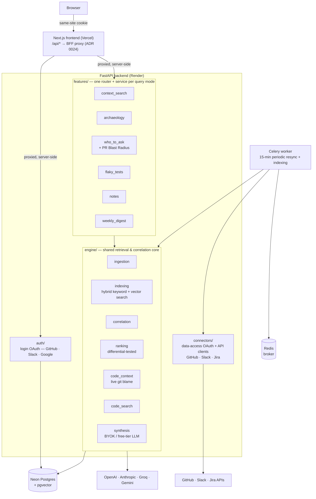

# Relay

A shared context engine that correlates GitHub, Slack, and Jira — six purpose-built query interfaces on **one** retrieval/correlation engine, not six disconnected integrations.

> "Who should I ask about `payments/retry.py`?" → Relay ranks contributors by commit recency and frequency, credits a reviewer who commented but never committed a line, and surfaces the Slack thread and Jira ticket tied to the same file.

**Live demo:** `https://therelay.vercel.app` — sign in with GitHub/Slack/Google.

## Features

| Mode | What it does |
|---|---|
| **Context Search** | Plain-English Q&A over connected GitHub/Slack/Jira activity, with real source citations. Raw retrieval is free by default; AI-summary mode supports OpenAI, Anthropic, Groq, or Gemini (BYOK, or a rate-limited free tier). |
| **Codebase Archaeology** | Pick a file → live git blame (GitHub GraphQL) traced back through each commit to the PR that introduced it, the Jira ticket it closed, and the Slack discussion from that time. |
| **Who Should I Ask** | Ranks who's touched a file, directory, or PR ("PR Blast Radius") by recency/frequency — including reviewers who commented without ever committing. |
| **Flaky Test Investigator** | Flags flaky vs. genuinely broken GitHub Actions workflows from real per-attempt outcomes, with a documented heuristic fallback where ground truth isn't available. |
| **Notes** | Freeform, or attached to a commit/PR/ticket/Slack message — indexed like every other source, so notes surface in Context Search too. |
| **Weekly Digest** | A time window instead of a keyword: everything across GitHub, Slack, Jira, and Notes in the last N days, optionally synthesized into shipped / in-progress / unresolved. |

## How it works

Every feature is a thin router + service calling into one shared `engine/` — retrieval, correlation, ranking, and LLM synthesis all live in one place, never duplicated per feature. A `features/*` module may only import `engine/`, never a sibling feature; when two features need the same logic, that's the signal it belongs in the engine, not a reason to cross-import.



**Tested by real feature work, not just asserted:**
- `engine/correlation` — extracted when Who Should I Ask needed Archaeology's ticket-correlation logic.
- `engine/synthesis` — extracted when Weekly Digest needed Context Search's LLM-synthesis logic.
- **PR Blast Radius** shipped as a new `target_type` on an existing endpoint, not a 7th page ([ADR 0023](docs/adr/0023-pr-blast-radius-entry-point.md)) — the ranking pipeline needed zero changes, only how the file set gets resolved.

`connectors/*` is the only place that talks to GitHub/Slack/Jira's real APIs — everything else works against `ingested_items`, one normalized table every connector writes into the same shape. Retrieval is polymorphic across four query shapes — keyword, file/directory/PR, git history, time window — all resolving to "relevant items" through the same engine, not four parallel implementations.

## Tech stack

| Layer | Choice |
|---|---|
| Backend | Python, FastAPI, SQLAlchemy 2.0 (async), Alembic |
| Database | PostgreSQL + pgvector (hybrid keyword/vector search), hosted on Neon |
| Background jobs | Celery + Redis |
| LLM synthesis | OpenAI, Anthropic, Groq, Gemini — BYOK or rate-limited free tier |
| Auth | OAuth 2.0 (GitHub, Slack, Google for login; GitHub, Slack, Jira for data access — deliberately separate apps, [ADR 0003](docs/adr/0003-two-token-auth-model.md)) |
| Frontend | Next.js (App Router), React, TypeScript, Tailwind CSS |
| Observability | Sentry, structured JSON logging |
| CI | GitHub Actions — ruff, mypy (strict), pytest with a coverage gate |
| Hosting | Render (backend + Celery worker), Vercel (frontend), Neon (Postgres) |

## Engineering decisions that mattered

### Empirically calibrated correlation threshold

**Problem:** deciding whether a Slack message or Jira ticket is genuinely *related* to a piece of code — not just superficially similar — needs a cutoff on the hybrid search score.

**Approach:** [`engine/correlation/service.py`](apps/api/src/relay_api/engine/correlation/service.py) measured real score distributions instead of guessing a round number: genuine matches scored 0.58–0.66; noise topped out at 0.384.

**Result:** `_MIN_RELEVANCE_SCORE = 0.48` — the midpoint of that gap, not the noise ceiling — biased toward precision for a feature that claims "this is related," a stronger claim than raw search ever makes.

**Tradeoff:** derived from one observed dataset, not a formal precision/recall curve — a reasoned calibration, not a guarantee that holds at every scale.

### Differential-tested ranking, not one "correct" answer

[`engine/ranking`](apps/api/src/relay_api/engine/ranking/strategies.py) implements two scoring strategies over the same touch history — recency-weighted (half-life decay) and frequency-weighted (raw touch count) — expected to *disagree*, not converge:

> Carol fixed one bug yesterday. Dave wrote most of the file in a burst eight months ago and hasn't touched it since. Recency favors Carol; frequency favors Dave. Neither answer is wrong.

[`tests/differential/test_ranking_strategies.py`](apps/api/tests/differential/test_ranking_strategies.py) asserts where the two strategies agree and documents, with this exact fixture, where and why they diverge. `features/who_to_ask` exposes both as a user-facing choice instead of collapsing them into one score — unlike `engine/indexing`'s search ranking, which does use a fixed 0.4/0.6 keyword/vector blend, because there both signals are meant to agree.

### Safari's cookie policy needed an architecture fix, not a flag

`SameSite=None; Secure` isn't enough once frontend and backend are on different domains — Safari's Intelligent Tracking Prevention blocks cross-site cookies on `fetch`/XHR regardless of that attribute. The fix ([ADR 0024](docs/adr/0024-bff-proxy-for-safari-cookie.md)) is a BFF proxy: `next.config.ts`'s `rewrites()` proxies every `/api/v1/*` call server-side, so every request — including the OAuth callback that mints the session cookie — stays same-site from the browser's perspective. This replaced the `SameSite=None` workaround entirely rather than sitting alongside it; there's no cookie attribute that fixes it once the request is genuinely cross-site.

### Three bugs behind one Redis quota, found by reading a library's source

**Symptom:** connecting GitHub/Slack intermittently returned a raw Internal Server Error — but refreshing showed the connection had actually succeeded. Every background sync job then started failing outright after moving from local Redis to Upstash (managed, TLS-only).

**Root-cause chain** — each link confirmed against source or live logs before moving to the next, not guessed:
1. Upstash's `rediss://` URLs need an explicit `ssl_cert_reqs` that Celery doesn't set by default — every `.delay()` call raised *after* the DB commit already succeeded, which is why a refresh showed the connection working.
2. Fixing that exposed a second bug: the Celery worker process never imports `auth/models.py`, so `ConnectorCredential`'s `ForeignKey("users.id")` couldn't resolve — `NoReferencedTableError` on the first real `db.commit()` in production.
3. Fixing that exposed a third: Upstash's 500,000-request/month cap, exhausted in about a week. `kombu`'s own source (`Transport.brpop_timeout = 1`) explained why — an idle worker polls Redis roughly once a second, forever, regardless of task volume: ~86,400 requests/day doing nothing.

**Fix:** `broker_transport_options={"polling_interval": 30}` plus `--without-gossip --without-mingle --without-heartbeat`. Idle polling drops to ~2,880 requests/day; real task latency is unaffected at this scale. All three bugs now have regression tests, not just a one-off fix.

## Testing and correctness

```
314 tests passing · 94.6% coverage on engine/ + features/ · CI gate at 85%
```
(A real, fresh run of the suite — not a stale figure.)

- **Unit** — mocks connectors/correlation at the boundary; tests each module's own logic (ranking math, ticket-key extraction, LLM provider error normalization).
- **Integration** — a real Dockerized `pgvector/pgvector:pg16` Postgres, exercising real SQL (`to_tsvector`, `cosine_distance`, `ON CONFLICT` upserts) that doesn't run against SQLite.
- **Differential** — `engine/ranking`'s two strategies, tested against synthetic touch histories built to make them disagree (see above), so a real behavioral difference is asserted, not just "it returns something."

CI (`.github/workflows/ci.yml`) runs ruff, `ruff format --check`, `mypy --strict`, and the full suite against a real Postgres+Redis service, failing under 85% coverage on `engine/` + `features/`.

## Build and run locally

**Prerequisites:** Node 22.13+, pnpm, Python 3.12+, [uv](https://docs.astral.sh/uv/), Docker (for local Postgres/Redis).

```bash
# Backend
uv sync
cp apps/api/.env.example apps/api/.env
# Fill in: SECRET_KEY, CONNECTOR_ENCRYPTION_KEY, OPENAI_API_KEY, and the
# GitHub/Slack/Google login + GitHub/Slack/Jira connector OAuth app
# credentials — see .env.example for how to generate the two secret keys.
# No OpenAI billing yet? Set EMBEDDING_PROVIDER=gemini and GEMINI_API_KEY
# instead — a free AI Studio key works, no credit card needed (ADR 0009).

# NOT plain postgres:16-alpine — needs the pgvector extension (ADR 0006).
docker run -d --name relay-pg -e POSTGRES_USER=relay -e POSTGRES_PASSWORD=relay \
  -e POSTGRES_DB=relay -p 5432:5432 pgvector/pgvector:pg16
docker run -d --name relay-redis -p 6379:6379 redis:7-alpine

uv run --package relay-api alembic -c apps/api/alembic.ini upgrade head
uv run --package relay-api uvicorn relay_api.main:app --app-dir apps/api/src --reload

# Celery worker (separate terminal) — runs indexing triggered on connect;
# the API works without it, but nothing gets ingested until it's running.
uv run --package relay-api celery -A relay_api.jobs.celery_app worker --loglevel=info

# Celery beat (separate terminal) — re-runs indexing every 15 minutes so
# activity after the initial connect eventually becomes searchable too.
uv run --package relay-api celery -A relay_api.jobs.celery_app beat --loglevel=info

# Frontend (separate terminal)
pnpm install
cp apps/web/.env.example apps/web/.env.local
pnpm --filter @relay/web dev
```

Backend runs at `http://localhost:8000`, frontend at `http://localhost:3000`. Sign in, then visit `/connections` to connect GitHub/Slack/Jira and `/search` to query them once the Celery worker has finished indexing.

```bash
# Tests need DATABASE_URL exported to your own container/port if it
# differs from pytest's CI-matching default (...localhost:5432/relay_test)
uv run --package relay-api pytest apps/api/tests
pnpm --filter @relay/web lint
```

## Project structure

```
apps/api/src/relay_api/
├── main.py               # app wiring only — CORS, router registration
├── auth/                 # login OAuth (GitHub · Slack · Google)
├── connectors/            # data-access OAuth + API clients (GitHub · Slack · Jira)
├── engine/                # shared retrieval/correlation core (see How it works)
├── features/              # one router + service per query mode
└── jobs/                  # Celery app, periodic resync, indexing tasks
apps/web/                  # Next.js (App Router) frontend
docs/
├── adr/                   # technical architecture decisions — what, why, how
├── decisions/              # product/scope decisions — what got cut and why
└── phases/                 # a retro per shipped phase, including bugs found live
```

## Deployment

Backend (FastAPI + Celery worker combined into one process — Render's free tier has no standalone background-worker service) on **Render**, frontend on **Vercel**, database on **Neon** (serverless Postgres with pgvector). `render.yaml` (repo root) is a live Render Blueprint documenting the exact build/start commands and environment variables.

Login and data-access OAuth are deliberately separate app registrations per provider ([ADR 0003](docs/adr/0003-two-token-auth-model.md)) — six OAuth apps across GitHub, Slack, Google, and Jira, all registering their callback URL under the **frontend's** domain, not the backend's (see the Safari cookie deep dive above).

## Limitations and explicitly deferred work

- **One connected account per provider** — a deliberate Phase 1 simplification, not an oversight (`connectors/models.py`).
- **Ticket-key extraction is a documented heuristic** (a regex over common Jira key shapes), not NLP — see [ADR 0010](docs/adr/0010-live-blame-and-repo-browsing.md). Works well for teams that reference ticket keys in commits/PRs; no fallback for teams that don't.
- **No frontend automated test suite** — CI runs ESLint and `tsc`/`next build` type-checking, not a test runner. Backend correctness is where the test investment went.
- **A Drift/Stale-Ticket Finder and a Dependency Alert Bot were both scoped and explicitly not built** — reasoning for each cut is in [`docs/decisions/`](docs/decisions/), not just dropped silently.
- **PR Blast Radius is reachable only through a search hit today** — no way to jump to an arbitrary PR by number if it hasn't already been indexed ([ADR 0023](docs/adr/0023-pr-blast-radius-entry-point.md)).

## Documentation

- [`docs/adr/`](docs/adr/) — technical architecture decisions: what, why, how.
- [`docs/decisions/`](docs/decisions/) — product/scope decisions: what got cut or deliberately deferred, and why.
- [`docs/phases/`](docs/phases/) — a retro per shipped phase, including bugs found live against real data.
- [`plan.md`](plan.md) — the original architecture/phase plan this project was built against.

## License

MIT
